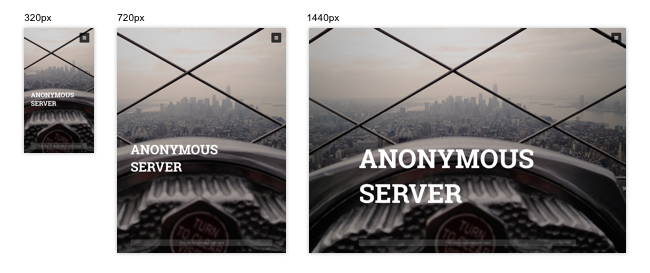
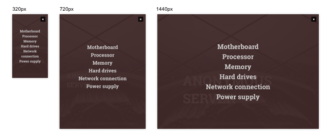

# Prueba técnica 4: Anonymous Server


## Resumen

Vamos a hacer una pequeña página responsive con un menú "desplegable".

## Guía gráfica
Esta imagen es una guía para hacernos una idea de cómo debería quedar.
Se entregan 3 imágenes de las vista de 320px, 768px y 1440px.
  

Y otras 3 del menú deplegado  


> Estas imágenes se pueden encontrar en la carpeta /guias/ al crear el repo con GitHub Classroom

También se puede consultar un pequeño prototipo online:
* [320px](https://sketch.cloud/s/Wdvqq/all/pages/mobile/play)
* [768px](https://sketch.cloud/s/Wdvqq/all/pages/tablet/play)
* [1440px](https://sketch.cloud/s/Wdvqq/all/pages/desktop/play)

## Requisitos
Hay que cumplir todo esto:
- Hay que usar el HTML tal y como se entrega
- Se entregan, además, 3 imágenes: la imagen de fondo, el icono de la hamburguesa y el icono de cerrar
- La imagen de fondo ocupará el 100% del espacio disponible (alto y ancho)
- Botones y enlaces tienen que tener, al menos, un efecto de `hover`
- El botón de menú NO sustituye al botón de cerrar
- Se pueden añadir clases extra por JavaScript siempre que se necesiten
- Hay que aplicar a la imagen de fondo por CSS un degradado vertical comenzando en negro al 35% en la mitad exacta del contenedor hasta negro totalmente transparente en la parte superior:
```css
background-image: linear-gradient(-180deg, rgba(0,0,0,0.00) 0%, rgba(0,0,0,0.35) 50%);
```
- El botón de menú mostrará el menú principal y habrá que plantear cómo se va a mostrar, es decir, no puede aparecer sin más, habrá que elegir una forma de transición concreta
- La fuente del titular es *Roboto Slab*
- La fuente del pie es *Arial*
- El color de fondo del menu es `#402929` al 92% de opacidad
- El título siempre tiene que ir en dos líneas
- La columna de contenido principal:
	- de 320 a 767px tiene 30px de margen a izquierda y derecha
	- a partir de 768px tiene 60px de margen y un ancho máximo de 990px
	- siempre tiene que quedar centrada
- El pie siempre tiene que quedar abajo de la pantalla
- No hay que usar React ni preprocesadores CSS


## Entrega
Tenéis que crear un nuevo repositorio en GitHub desde GitHub Classroom usando [este enlace](https://classroom.github.com/a/giOTLxgG). Una vez creado invitaremos a nuestro voluntario, lo clonaremos en nuestro ordenador y en la carpeta creada empezaremos a trabajar en el ejercicio.

## Guión exposición
Os proponemos un guión para presentar el ejercicio pero el entrevistador podrá variarlo o redirigirlo en cualquier momento:
- Prioridades a la hora de enfrentar la prueba
- Transición elegida y su aplicación
- Estructura de JavaScript
