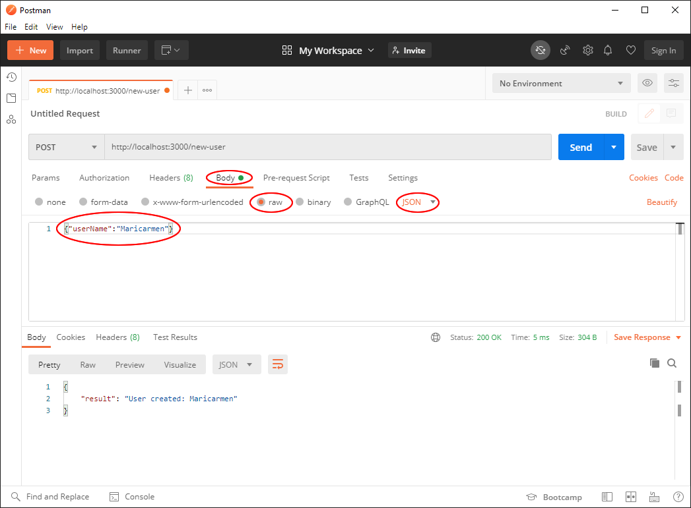

# Postman

Es muy frecuente que cuando programamos un servidor no tengamos programada la correspondiente web que va a comunicarse con el servidor.

En ese momento tenemos el problema de programar un servidor y no tener la web para probar que lo que estamos haciendo funciona bien.

Para ello existe una herramienta muy útil que nos permite hacer cualquier petición a un servidor. Es como si fuera una web universal que se puede comunicar con cualquier servidor del mundo.

Esa herramienta se llama **Postman** y es muy muy útil mientras estamos programando.

## Instalación de Postman

Para instalar Postman en tu ordenador:

1. Descarga e instala Postman en tu ordenador:
   - Desde Windows o Mac entra en la [página de descargas de Postman](https://www.postman.com/downloads/).
   - Desde Ubuntu accede al instalador de aplicaciones desde el menú, busca **Postman** e instálalo.
1. Ábrelo:
   - Si al abrirlo te pide que te registres, debes saber que no hace falta. Sáltate este paso pulsando en **Skip signing in and take me straight to the app**.
1. Abre una nueva pestaña pulsando en el icono +.
1. Empieza a hacer peticiones a un servidor como si hubiera un mañana. Recuerda que el servidor debe estar arrancado para que conteste a las peticiones.

## ¿Cómo usar Postman?



> [Ejercicio del vídeo](https://github.com/Adalab/ejercicios-de-los-materiales/tree/main/promo-l/4-2-express-postman)

## Enviar datos a en una petición con Postman

**Este es un pequeño recordatorio de lo que hemos visto en el vídeo anterior.** Cuando hacemos una petición POST y queremos enviar datos tenemos que:

- Seleccionar el verbo, casi siempre va a ser **POST** (el verbo GET no permite enviar datos en el body).
- Poner la URL, en la imagen es http://localhost:3000/new-user.
- Entrar en la pestaña **Body**.
- Seleccionar la opción **raw**.
- Seleccionar el formato **JSON**.
- Escribir correctamente en formato JSON los datos que queremos enviar. El formato JSON requiere los nombres de las propiedades estén entre comillas dobles `"` (en la imagen `"userName"`).

## Ejercicios

### 1. Usa Postman

1. Descarga, instala y arranca este [ejercicio](https://github.com/Adalab/ejercicios-de-los-materiales/tree/main/promo-l/4-2-express-postman).
1. Abre la página http://localhost:3000.
   1. Abre Devtools > Network y mira qué peticiones se hacen cuando pulsamos en los botones de la página.
1. Realiza las mismas peticiones desde Postman y comprueba que la respuesta que muestra Postman es la misma que muestra la pestaña de Devtools > Network.